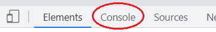
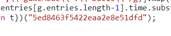
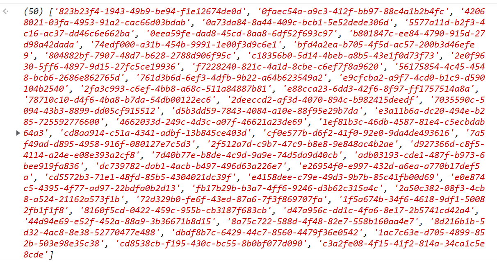
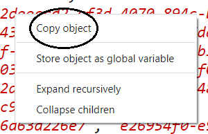
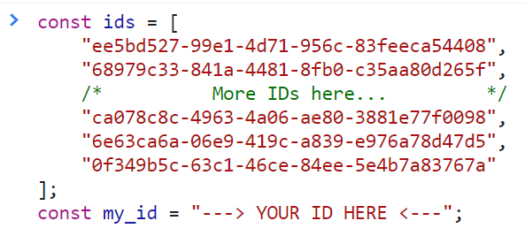
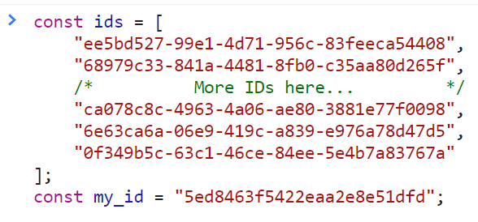
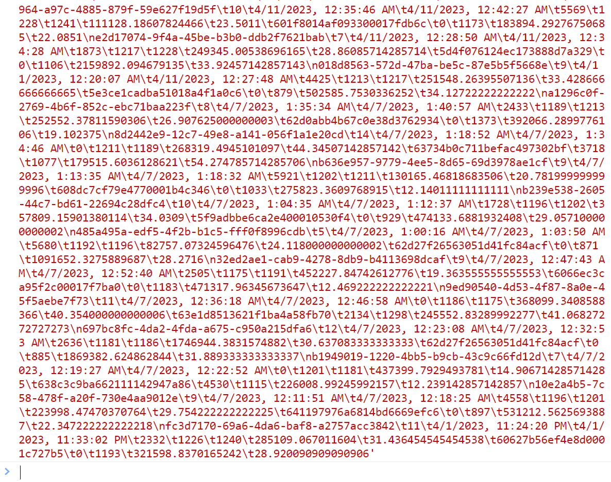
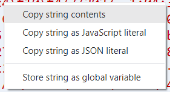
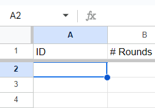

# GeoGeussr Duels Stats Fetcher

This repo contains a collection of scripts to fetch all of your duels and their stats, and output them into a spreadsheet-safe format.

I have included both the minified version to paste into the console and also the pre-compiled version if you don't trust the code (who would?). You can find the minified script [here](main_condensed.js) and the full version [here](main.js)


*Disclaimer:* I do not condone the spam nor abuse of GeoGuessr's API. These script are intended for data analysis purposes only, and are not for misuse or exploitation of GeoGuessr. The use of the API is non-official, and may be revoked or blocked at any time. Not affiliated with GeoGuessr or any related entities. 

# Instructions

Using the scripts to retrieve your data is very simple. 

**Note:** All of the following steps were performed and screenshotted in Chrome. Other browsers may not work as intended, but feel free to try them out. Please make sure you are logged in or GeoGuessr's API won't let you access the data. 

## Phase 1: Fetching Duel IDs

1. Open [your GeoGuessr profile](https://www.geoguessr.com/me/profile)

2. Scroll to the bottom of the page and find your profile link:


3. Keep note of the ID part. It should be a bunch of numbers/letters, something like `5ed8463f5422eaa2e8e51dfd`

4. While on the same page, press `F12` on your keyboard or `Right Click` and click `Inspect` at the bottom of the context menu.

5. Navigate to the `Console` tab of the new window that just opened:



6. Paste the following code snippet into the console. Don't press enter or submit yet.
```javascript
await(async(d)=>{let e="",t=[];for(let a=0;a<100;a++){console.log("Fetching page",a+1);let l="https://www.geoguessr.com/api/v4/feed/private";""!==e&&(l+="?paginationToken="+e);let n=await fetch(l),g=JSON.parse(n=await n.text());if(0===g.entries.length){console.log("All data fetched.");break}t.push(...[...n.matchAll(/\\"gameId\\":\\"([\w\d\-]*)\\",\\"gameMode\\":\\"Duels\\"/g)].map(e=>e[1])),e=btoa(`{"HashKey":{"S":"${d+"_activity"}"},"Created":{"S":"${g.entries[g.entries.length-1].time.substring(0,23)+"Z"}"}}`),await new Promise(e=>{setTimeout(()=>{e()},500)})}return t})("--->YOUR ID HERE<---");
```

7. Replace `--->YOUR ID HERE<---` at the end of the script with your ID you copied in step 3. Make sure you paste your ID inside the quotation marks (`"`). The end of the script should now look like:



8. Press enter and wait for the script to run. By default, it will pull 100 pages of your activities (or until it runs out). Once it is done running, you should see some text printed in the console that looks something like:



9. `Right click` on this block of data and select `Copy object`:



10. You are done with phase 1! Make sure not to close this window, in case you need to copy it again.


## Phase 2: Fetching Duel Data

From what I've tested, this step doesn't seem to work in Firefox but works fine in Chrome. I haven't tested other browsers, but if you encounter an error, try running it in Chrome first.

1. In a new window, navigate to the [GeoGuessr API](https://game-server.geoguessr.com/).

2. Open the console again. If you aren't sure how to, reference Steps 4 and 5 of Phase 1.

3. In the console, paste the following code snippet. Like before, do not press enter or submit the code yet. If you do, you can refresh the page and try again.
```javascript
const ids = /*---> DATA FROM LAST STEP HERE <---*/;
const my_id = "---> YOUR ID HERE <---";
```

4. Replace `/*---> DATA FROM LAST STEP HERE <---*/` with the data you copied at the end of Phase 1. Make sure to replace the entire thing. It should look something like:



5. Replace `---> YOUR ID HERE <---` with your ID you copied at the beginning of Phase 1. If you need to, you can re-copy it from the same page. The code snippet should now look something like:



6. Press `enter` to submit the code.

7. Paste the following code snippet in the console:
```javascript
function C(e,r){let t=0,s=0,a=0;for(let n of e)a++,t+=n.distance,s+=(new Date(n.created)-new Date(r[n.roundNumber-1].startTime))/1e3;return 0===a?["",""]:[t/a,s/a]}(await(async function D(e,r){d=[];let t=0;for(let s of r){console.log("Fetching duel #"+t++);let l=await fetch("https://game-server.geoguessr.com/api/duels/"+s);l=await l.json();let o=[];for(let i of(o[0]=l.gameId,o[1]=l.currentRoundNumber,o[2]=new Date(l.rounds[0].startTime).toLocaleString("en-US"),o[3]=new Date(l.rounds[o[1]-1].endTime).toLocaleString("en-US"),l.teams))if(i.players[0].playerId===e){if(o[4]=i.health,null===i.players[0].progressChange)o[5]=i.players[0].rating,o[6]="";else{let $=i.players[0].progressChange.competitiveProgress;o[5]=$.ratingBefore,o[6]=$.ratingAfter}[o[7],o[8]]=C(i.players[0].guesses,l.rounds)}else o[9]=i.players[0].playerId,o[10]=i.health,o[11]=i.players[0].rating,[o[12],o[13]]=C(i.players[0].guesses,l.rounds);d.push(o),await (new Promise(e=>{setTimeout(()=>e(),100)}))}return d})(my_id,ids)).map(v => v.join("\t")).join("\n");
```

8. Press `enter` to submit the code. Wait for it to retrieve the data for each of the IDs you copied from Phase 1. Once it is done running, you should see a big block of text:



9. `Right click` on the block of text and select "Copy string contents":



10. You can now paste this data into any spreadsheet!

## Phase 3: Data Visualization

To visualize the data you just copied at the end of phase 2, you can make your own spreadsheet or use one I have created. By default, the spreadsheet calculates stats up to 999 duels. If you want to include more, you might need to edit the formulas and extend the calculations sheet. To use my spreadsheet template:

1. Go to [the Google Sheets document](https://docs.google.com/spreadsheets/d/1rz5nRHU-lnUDRdMF8QLMaWB_JkRrGSWsUGKtE-XkPPY/edit?usp=sharing)

2. Under `File`, click "Make a copy".

3. In your copy of the spreadsheet, paste the data as you copied it into the cell `A2` on the `RAW` sheet.



4. Navigate to the `Data` sheet using the tabs at the bottom to view your processed data and graphs.

